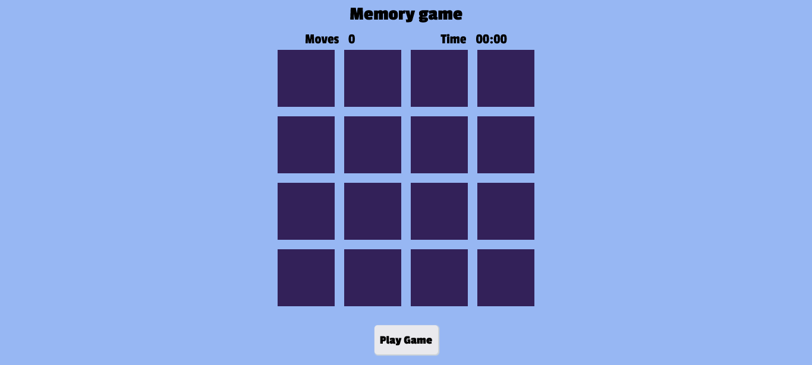
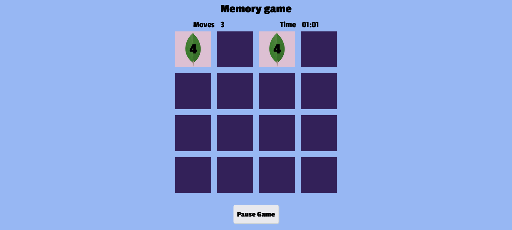
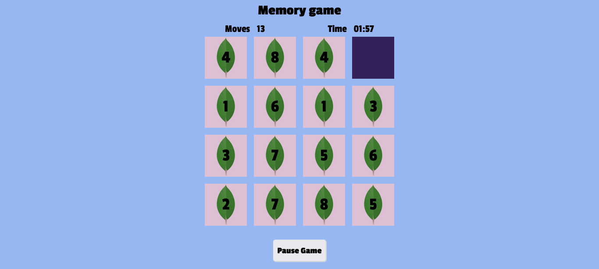
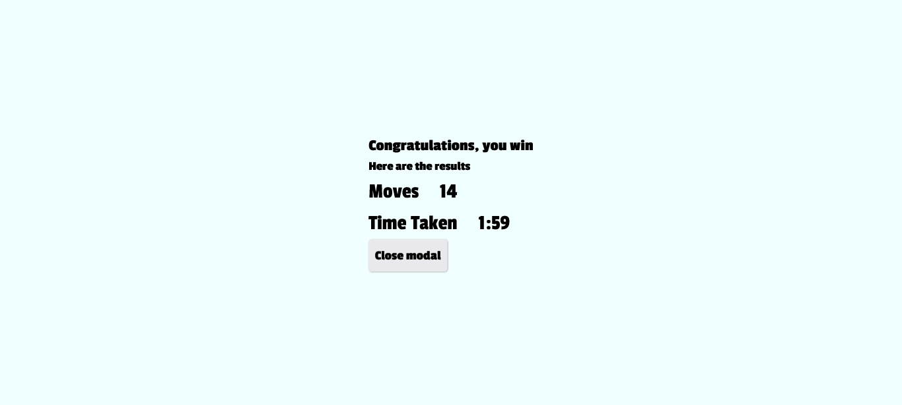

# The Memory Game

## A React and mongo realm application

## Table of contents

- [Overview](#overview)
  - [The challenge](#the-challenge)
  - [Screenshot](#screenshot)
  - [Links](#links)
- [My process](#my-process)
  - [Built with](#built-with)
  - [What I learned](#what-i-learned)
  - [Continued development](#continued-development)
  - [Useful resources](#useful-resources)
- [Author](#author)
- [Acknowledgments](#acknowledgments)

## Overview

## The challenge

User should be able to:

- play the game on mobile, tablet , desktop devices. The game is responsive
- allow users to play the game using the keyboard

### Screenshot






### Links

- [Live preview link](https://memory-game-chamu-2021.netlify.app/)

## My process

### Built with

- This project was bootstrapped with [Create React App](https://github.com/facebook/create-react-app).
- The data was created using Mongodb Compass
- Used Mongo Realm  for data fetching using the built in functions

### What i learned

#### Setting up Mongodb Realm

- Create a Mongodb account if you have done so - it is free	
- Connect to Mongo atlas( Mongodb database as a service) to be able to use your databases.  It is a fully cloud managed automated database . It also has free tier that does not require a credit card to connect to. Follow the steps and setup your own cluster and load the sample databases.
- VS code has an extension to connect to MongoDb, which gives you access to make crud operations 
- I created a json file of the data that will make part of my database. The connection to the data can be done with the VS CODE  extension for mongodb. My option for this was to explore another feature of MongoDb known as Mongo Compass. With compass you can create a database and load the content from a json file. If the data does not have a `_id` , this will automatically be added to the data.

#### Creating the Functions in Realm

- Realm has a function editor that assist you to get started. The functions created will be used in the frontend to get the data. Here is the function that i used to get all the data.

```js
exports = function(arg){
 
    let collection = context.services.get("mongodb-atlas").db("memoryGame").collection("memory");
   
  return collection.find({});
};
```

#### Getting the data in the React Frontend

- the code to get the data from Mongo Realm

```js
const fetchData = async () => {
    setFetchStatus("loading")
    const REALM_APP_ID = "memory-game-qxhym"
    const app = new Realm.App({ id: REALM_APP_ID });
    const credentials = Realm.Credentials.anonymous();
    try {
      const user = await app.logIn(credentials);
      const allNumbers = await user.functions.getAllNumbers()
      //setNums(allNumbers.sort(() => Math.random() - 0.5))
      setNums(shuffle(allNumbers))
      setFetchStatus("success")
      //  console.log(nums)
    } catch (err) {
      setError(err)
      setFetchStatus("error")
      console.error(err);
    }
  }
```


### Continued development

### Useful resources

